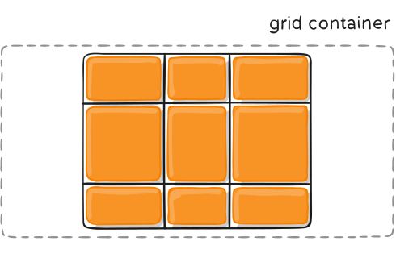
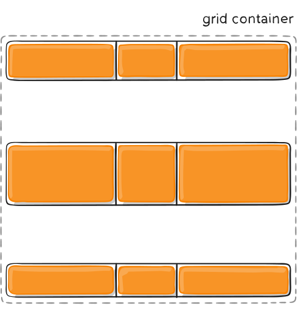
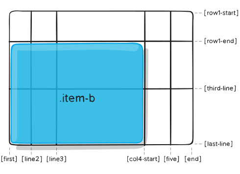
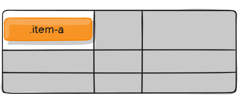

# css grid布局

与flex布局不同，grid布局可以控制二维空间，而flex布局只能控制一维的。

## 参考

- [css-tricks](https://css-tricks.com/snippets/css/complete-guide-grid/#prop-justify-items)

## 容器属性

##### dispaly

定义元素为表格布局容器，并为它的元素建立一个新的表格布局上下文。

```css
.container {
    display: grid | inline-grid;
}
```

- ```grid``` 建立 ```block``` 级别的grid布局
- ```inline-grid``` 建立 ```inline``` 级别的grid布局

##### grid-template-columns / grid-template-rows

定义表格的行和列。

```css
.contaienr {
    grid-template-columns: <track-size> ... | <line-name> <track-size> ...;
    grid-template-row: <track-size> ... | <line-name> <track-size> ...;
}
```

值用空格分开，定义每行、列的大小。也可以指定行、列的名称。

- ```track-size``` 可以是固定的长度、百分比、占据布局剩余空间的比例。

当你没有指定行、列的名称时，grid 会自动为每条网格线命名

```css
.container {
    grid-template-columns: 40px 50px auto 50px 40px;
    grid-template-rows: 25% 100px auto;
}
```


你也可以为每条线命名

```css
.container {
    grid-template-columns: [first] 40px [line2] 50px [line3] auto [col4-start] 50px [five] 40px [end];
    grid-tempate-rows: [row1-start] 25% [row1-end] 100px [third-line] auto [last-line]; 
}
```


每条线可以有多个名称

```css
.contaienr {
    grid-template-rows: [row1-start] 25%  [row1-end row2-start] 25% [row2-end];
}
```

如果是重复的定义，可以使用```repeat```来进行精简

```css
.container {
    grid-template-columns: repeat(3, 20px [col-start]);
}
```

如果多条线使用相同的名称，可以使用名称和数量进行引用

```css
.item {
    grid-column-start: col-start 2;
}
```

单位```fr```用于设置占用 grid 剩余空间的比例。

例如以下设置可以让每列占用 grid 宽度的三分之一

```css
.container {
    grid-template-columns: 1fr 1fr 1fr;
}
```

##### grid-template-areas

通过引用 ```grid-area```属性定义的网格区域的名称，来定义网格模板。多个区域使用相同名称，则该名称占据这些区域。一个 ```.``` 代表一个空格子。

```css
.container {
    grid-template-areas: "<grid-area-name> | . | node | ..."
    "...";
}
```

- ```grid-template-area``` 网格区域名称

例子:

```css
.item-a {
    grid-area: header;
}
.item-b {
    grid-area: main;
}
.item-c {
    grid-area: sidebar;
}
.item-d {
    grid-area:  footer;
}

.container {
    display: grid;
    grid-template-columns: 50px 50px 50px 50px;
    grid-template-rows: auto;
    grid-template-areas: 
        "header header header header"
        "main main . sidebar"
        "footer footer footer footer";
}
```


当你使用这种语法为区域命名时，网格线会被自动命名。如果区域名称为```foo```，则区域起始行名称为 ```foo-start```，结束行名称为```foo-end```。

##### grid-template

grid-template-rows、grid-template-columns、grid-template-areas的简写。

```css
.container {
    grid-template: node | <grid-template-rows> / <grid-template-columns>;
}
```

设置```grid-template-rows```与```grid-template-columns```的值，同时设置```grid-template-areas```为空

也可以使用更加复杂的语法同时设置三种属性

```css
.container {
    grid-template: 
        [row1-start] "header header header" 25px [row1-end]
        [row2-start] "footer footer footer" 25px [row2-end]
        / auto 50px auto;
}
```

它等同于以下定义

```css
.container {
    grid-template-rows: [row1-start] 25px [row1-end row2-start] 25px [row2-end];
    grid-tempalte-columns: auto 50px auto;
    grid-template-areas:
        "header header header"
        "footer footer footer";
}
```

##### column-gap/row-gap

设置行列间距

```css
.container {
    column-gap: <line-size>;
    row-gap: <line-size>;
}
```

例子: 

```css
.container {
    grid-template-columns: 100px 50px 100px;
    grid-template-rows: 80px auto 80px;
    column-gap: 10px;
    row-gap: 15px;
}
```


##### gap

row-gap、column-gap的简写

```css
.container {
    gap: <grid-row-gap> <grid-column-gap>;
}
```

#### justify-items

在(row)轴上进行对齐。

```css
.container {
    justify-items: start | end | center | stretch;
}
```

列子: 

```css
.container {
    justify-items: start;
}
```


```css
.container {
    justify-items: end;
}
```


```css
.container {
    justify-items: center;
}
```


```css
.container {
    justify-items: stretch;
}
```


#### align-items 

在(column)轴上进行对齐。

```css
.container {
    align-items: start | end | center | stretch;
}
```

例子：

```css
.container {
    align-items: start;
}
```


```css
.container {
    align-items: end;
}
```


```css
.container {
    align-items: center;
}
```


```css
.container {
    align-items: stretch;
}
```


#### place-items

align-items、justify-items的简写

```css
.container {
    place-items: <align-items> / <justify-items>;
}
```

如果只有一个值，则两个属性设为相同值。

#### justify-content

当所有子项大小之和小于容器的大小时，用此属性对内容的(row)轴进行对齐。

```css
.container {
    justify-content: start | end | center | stretch | space-around | space-between | space-evenly;
}
```

- space-around: 每个子项周围均分剩余空间，最左侧和最右侧各占据0.5份。
- space-between: 每个子项周围均分剩余空间，最左侧和最右侧没有空间
- space-evenly: 每个子项周围均分剩余空间，最左侧和最右侧各占据一份。

例子:

```css
.container {
    justify-content: start;
}
```


```css
.container {
    justify-content: end;
}
```


```css
.container {
    justify-content: center;
}
```



```css
.container {
    justify-content: stretch;
}
```


```css
.container {
    justify-content: space-around;
}
```


```css
.container {
    justify-content: space-between;
}
```


```css
.container {
    justify-content: space-evenly;
}
```


#### align-content

当所有子项大小之和小于容器的大小时，用此属性对内容的(column)轴进行对齐。

```css
.container {
    align-content: start | end | center | stretch | space-around | space-between | space-evenly;
}
```

- space-around: 每个子项周围均分剩余空间，第一个和最后一个各占据0.5份。
- space-between: 每个子项周围均分剩余空间，第一个和最后一个没有空间
- space-evenly: 每个子项周围均分剩余空间，第一个和最后一个各占据一份。

例子：

```css
.container {
    align-content: start;
}
```


```css
.container {
    align-content: end;
}
```


```css
.container {
    align-content: center;
}
```


```css
.container {
    align-content: stretch;
}
```


```css
.container {
    align-content: space-around;
}
```


```css
.container {
    align-content: space-between;
}
```



```css
.container {
    align-content: space-evenly;
}
```


#### place-content

align-content与justify-content的缩写

#### grid-auto-columns/grid-auto-rows

指定自动生成的单元格的大小。

```css
.container {
    grid-auto-columns: <track-size> ...;
    grid-auto-columns: <track-size> ...;
}
```

track-size可以为长度、半分比或者fr单位

例子：

```css
.container {
    grid-template-columns: 60px 60px;
    grid-template-rows: 90px 90px;
}
```


现在生成了一个 2 * 2 的网格。

```css
.item-a {
    grid-column: 1 / 2;
    grid-row: 2 / 3;
}
.item-b {
    grid-column: 5 / 6;
    grid-row: 2 / 3;
}
```


由于并未定义 2 * 2 之外的网格，所以会自动创建其他的网格，但网格宽度为0，我们可以通过设置 grid-auto-columns/grid-auto-rows 来指定自动生成的网格的大小。

```css
.container {
    grid-auto-columns: 60px;
}
```


#### grid-auot-flow

如果没有明确的指定子项的位置，会通过自动布局算法对子项进行定位，此属性用于控制算法如何起作用。

```css
.container {
    grid-auto-flow: row | column | row dense | column dense;
}
```

- row 按行填充
- column 按列填充
- dense 

列子:

```html
<section class="container">
    <div class="item-a">item-a</div>
    <div class="item-b">item-b</div>
    <div class="item-c">item-c</div>
    <div class="item-d">item-d</div>
    <div class="item-e">item-e</div>
</section>
```

```css
.container {
    display: grid;
    grid-template-columns: 60px 60px 60px 60px 60px;
    grid-template-rows: 30px 30px;
    grid-auto-flow: flow;
}
```

创建了一个 5 * 2 的网格，并将 `grid-auto-flow` 设为 `row`

```css
.item-a {
    grid-column: 1;
    grid-row: 1 / 3;
}
.item-e {
    grid-column: 5;
    grid-row: 1 / 3;
}
```


如果将 `grid-auto-flow` 设为 `cloumn`

```css
.contaienr {
    display: grid;
    grid-template-columns: 60px 60px 60px 60px 60px;
    grid-template-rows: 30px 30px;
    grid-auto-flow: column;
}
```


#### grid

grid-template-rows、grid-template-columns、grid-template-areas、grid-auto-rows、grid-auto-columns、grid-auto-flow的简写

语法太复杂，还是不用了吧

## 子项属性

**`flow`、`display: inline-block`、`display: table-cell`、`vertical-align`与`column-*`属性对子元素没有任何作用。**

#### grid-column-start/grid-column-end/grid-row-start/grid-row-end

根据引用网格线来确定一个网格的位置

```css
.item {
    grid-column-start: <number> | <name> | span <number> | span <name> | auto;
    grid-column-end: <number> | <name> | span <number> | span <name> | auto;
    grid-row-start: <number> | <name> | span <number> | span <name> | auto;
    grid-row-start: <number> | <name> | span <number> | span <name> | auto;
}
```

- \<line\> 可以用数字、或者名称来引用网格线
- span \<number/> 改网格可以横框number个网格
- span \<name\> 在两条线之间
- auto 

例子：

```css
.item-a {
    grid-column-start: 2;
    grid-column-end: five;
    grid-row-start: row1-start;
    grid-row-end: 3;
}
```


```css
.itme-b {
    grid-column-start: 1;
    grid-column-end: span sol4-start;
    grid-row-start: 2;
    grid-row-end: span 2;
}
```



如果没有设置`grid-column-end`/`grid-row-end`,默认横框1个网格。

子项之间可以互相覆盖，可以通过设置`z-index`来指定覆盖规则。

#### grid-column/grid-row

grid-column-start、grid-column-end与grid-row-start、grid-row-end的缩写

```css
.item {
    grid-column: <start-line> / <end-line> | <start-line> / span <value>;
    grid-row: <start-line> / <end-line> | <start-line> / span <value>;
}
```

例子：

```css
.item-c {
    grid-column: 3 / span 2;
    grid-row: third-line / 4;
}
```


#### grid-area

可以引用grid-template-areas属性定义的区域，或者作为grid-row-start、grid-column-start、grid-row-end、grid-column-end的缩写。

```css
.item {
    grid-area: <name> | <row-start> / <column-start> / <row-end> / <column-end>;
}
```

例子：

引用

```css
.item-d {
    grid-area: header;
}
```

缩写

```css
.item-d {
    grid-area: 1 / col4-start / last-line / 6;
}
```


#### justify-self

子项(row)轴方向的对齐方式

```css
.item {
    justify-self: start | end | center | stretch;
}
```

例子：

```css
.item-a {
    justify-self: start;
}
```


```css
.item-a {
    justify-self: end;
}
```


```css
.item-a {
    justify-self: center;
}
```


```css
.item-a{
    justify-self: stretch;
}
```


#### align-self

子项(column)轴方向的对齐方式

```css
.item {
    align-self: start | end | center | stretch;
}
```

例子：

```css
.item-a {
    align-self: start;
}
```


```css
.item-a {
    align-self: end;
}
```


```css
.item-a {
    align-self: center;
}
```


```css
.item-a {
    align-self: stretch;
}
```


#### place-self

place-self是align-self与justify-self的缩写

```css
.item-a {
    place-self: center;
}
```


```css
.item-a {
    place-self: center stretch;
}
```

