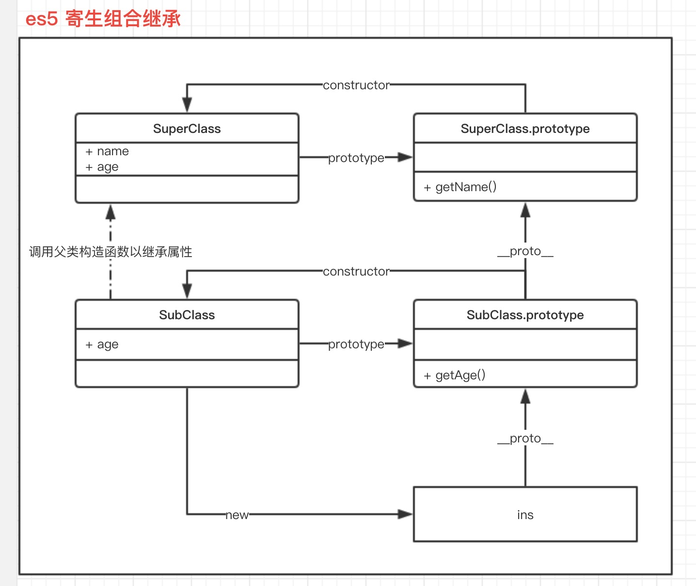
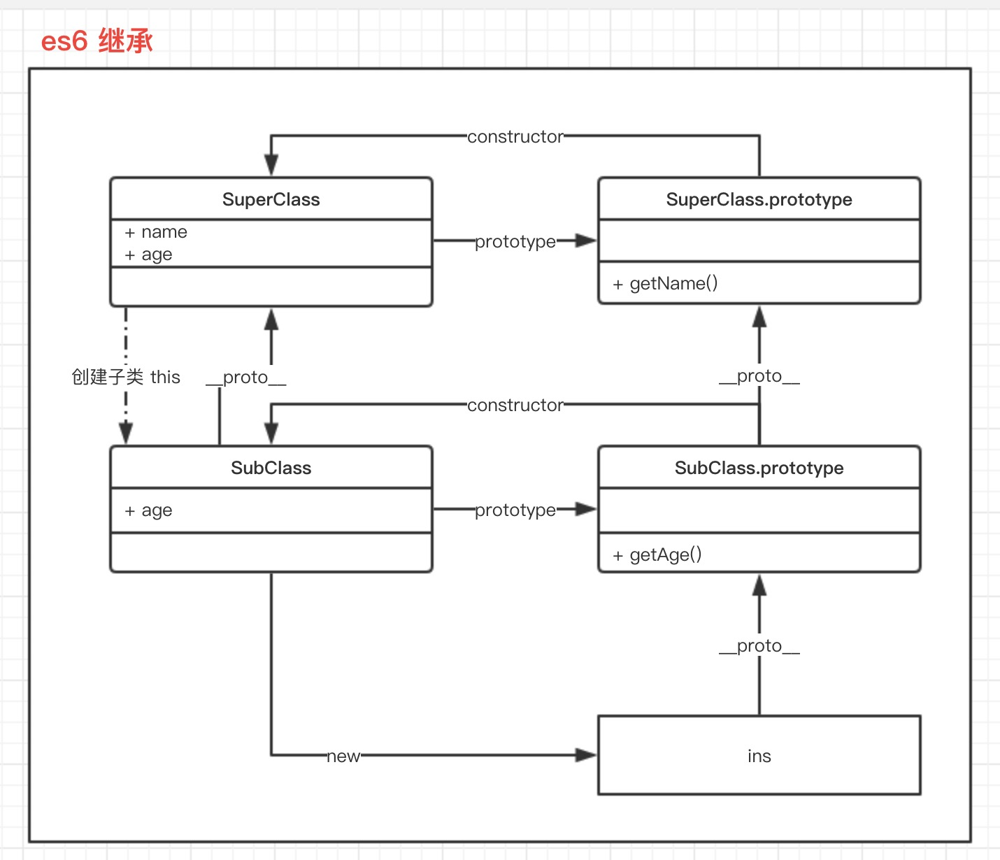

# es5 与 es6 继承的区别

## es5

```js
function SuperClass(name) {
    // 实例放属性
    this.name = name
    this.age = 18
}

// 原型存方法
SuperClass.prototype.getName = function() {
    return this.name
}

function SubClass(name, age) {
    // 调用父类构造函数继承属性
    SuperClass.call(this, name)
    this.age = age
}

// 子类原型为父类原型的实例
SubClass.prototype = Object.create(SuperClass.prototype)
// 修正指向
SubClass.prototype.constructor = SubClass
// 子类原型方法
SubClass.prototype.getAge = function () {
    return this.age
}

const ins = new SubClass('xxx', 20)
ins.__proto__ === SubClass.prototype // true
ins.__proto__.constructor ===  SubClass // true
ins.__proto__.__proto__ === SuperClass.prototype // true
```


## es6

```js
class SuperClass {
    constructor(name) {
        this.name = name
        this.age = 18
    }

    getName() {
        return this.name
    }
}

class SubClass extends SuperClass {
    constructor(name, age) {
        super(name)
        this.age = age
    }

    getAge() {
        return this.age
    }
}

const ins = new SubClass('xxx', 20)
ins.__proto__ === SubClass.prototype // true
ins.__proto__.constructor ===  SubClass // true
ins.__proto__.__proto__ === SuperClass.prototype // true
SubClass.__proto__ === SuperClass // true
```



## 区别

- es5 现有子类的 this 通过调用父类构造函数为 子类 this 添加属性与方法，而 es6 中需先调用 super 来创建子类的 this 
- es6 中子类与父类通过 \_\_proto\_\_ 进行连接
- es5 中无法继承静态属性与方法，只能手动赋值，es6 中可以继承静态属性与方法。