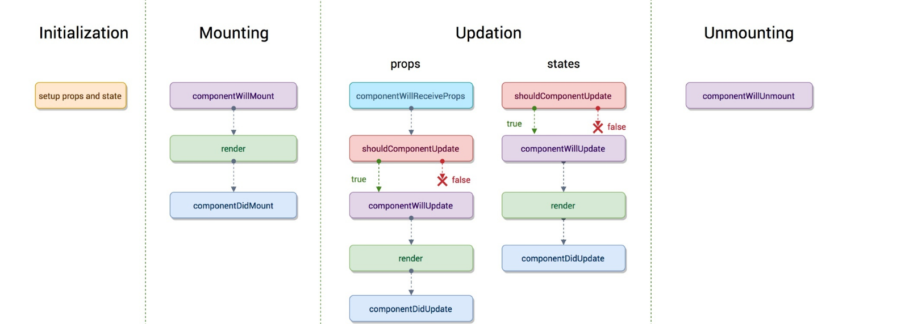
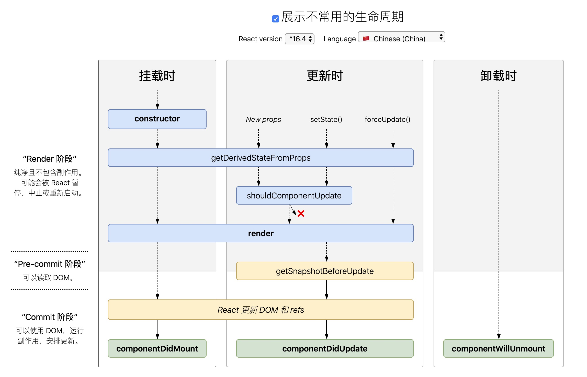

# React 生命周期

### 使用 Hooks 模拟生命周期

- getDerivedStateFromProps，根据 props 来重新计算当前 state ，可以使用 useState 实现

    ```tsx
    function ScrollView({row}) {
        const [isScrollingDown, setIsScrollingDown] = useState(false)
        const [preRow, setPreRow] = useState(null)

        // 当前状态与 props 状态不同步
        if (row !== preRow) {
            setIsScrollingDown(preRow !== null && row > preRow)
            setPreRow(preRow)
        }

        return `Scrolling down: ${isScrollingDown}`
    }
    ```
- shouldComponentUpdate，可以使用 useMemo 包裹一个组件，对它的 props 进行浅比较

    ```tsx
    const Button = React.memo((props) => {

    })
    ```

- componentDidMount，componentDidUpdate，可以使用 useEffect 与 useLayoutEffect 实现。
useLayoutEffect 会在更新 dom 时调用, useEffect 会延迟到绘制完毕

```tsx
useEffect(() => {
    // componentDidMount 时执行
}, [])

useEffect(() => {
    // componentDidMount & deps 发生改变时调用

    return () => {
        // count 更改时 componentDidUpdate
        // componentWillUnmount
    }
}, [...deps])
```

| class组件 | Hooks 组件 |
|---|---|
| constructor | useState |
| getDerivedStateFromProps | useState |
| shouldComponentUpdate | useMemo |
| render | function |
| componentDidMount | useEffect |
| componentDidUpdate | useEffect |
| componentWillUnmount | useEffect cleanUp |
| componentDidCatch | 无 |
| getDerivedStateFromError | 无 |

### 单个组件的生命周期

##### 16.3 之前

生命周期分为三个阶段

- 挂载阶段
- 组件更新阶段
- 卸载阶段

1. 挂载阶段
    - constructor 
    - componentWillMount
    - render
    - componentDidMount
2. 组件更新阶段
    - componentWillReceiveProps
    - shouldComponentUpdate
    - componentWillUpdate
    - render
    - componentDidUpdate
3. 卸载阶段
    - componentWillUnmount



##### 16.3 之后

1. 挂载阶段
    - constructor
    - static getDerivedStateFromProps
    - render
    - componentDidMount
2. 更新阶段
    - static getDerivedStateFromProps
    - shouldComponentUpdate
    - render
    - getSnapshotBeforeUpdate
    - componentDidUpdate
3. 卸载阶段
    - componentWillUnmount



### 参考
[深入 React 生命周期](https://github.com/sisterAn/blog/issues/34)