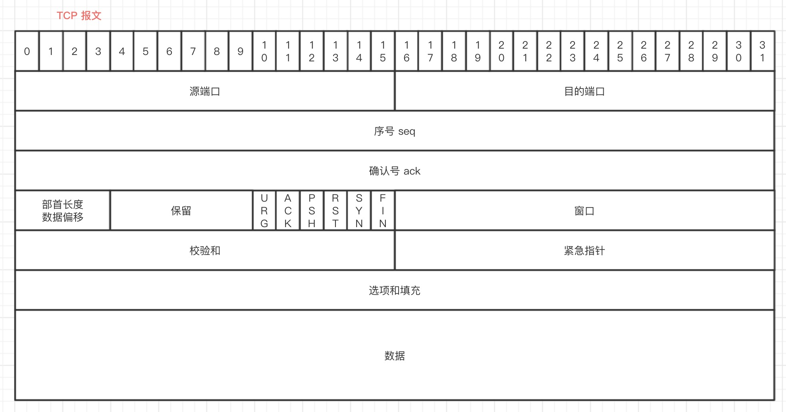
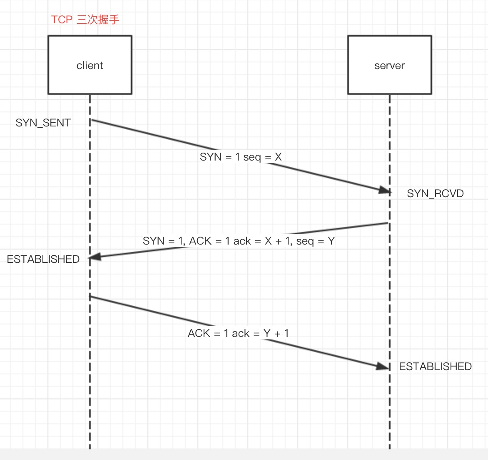
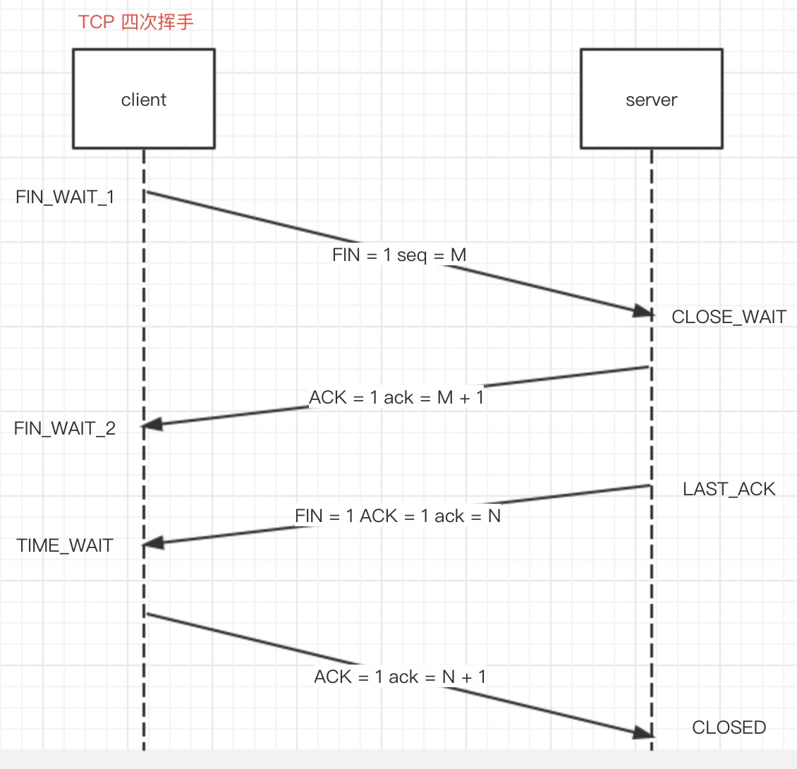

# TCP

## TCP 报文

TCP 报文是 TCP 层传输的数据单元，也叫报文段

### 端口号

TCP 报头中的源端口和目的端口与 IP 数据报头中的源 IP 与目的 IP 唯一确定一条 TCP 连接

### 序号和确认号

是 TCP 可靠传输的关键部分。
**序号**是本报文段发送的数据组的第一个字节的序号。在 TCP 传送的流中，每一个字节一个序号(一个报文段的序号为300，此报文段数据部分共有100字节，则下一个报文段的序号为400)。因此序号保证了 TCP 传输的有序性。
**确认号**，即 ACK，指明下一个期待收到的字节序号，表明该序号之前的所有数据已经正确无误的收到。确认号只有当 ACK 标志为1时才有效。因此确认号保证了 TCP 传输的完整性。

### 部首长度/数据偏移

4bits。由于部首可能含有可选内容，因此 TCP 报头长度不确定，报头不包含任何可选字段长度为20字节，4位部首长度可表示的最大范围为15（十进制），15 * 32 / 8 = 60，因此**报头最大长度为60字节**。部首长度实际上指示了数据区在报文段中的起始偏移量。

### 保留

为新的用途保留，一般置0。

### 控制位

1. URG: 紧急指针标志
2. ACK: 确认号标志
3. PSH push 标志 指示接收方在接收到改报文段以后，应尽快将这个报文段交给应用程序，而不是在缓冲区排队。
4. RST: 重置连接标志，用于重置由于主机崩溃或其他原因而出现的错误连接。或者用于拒绝非法的报文段和拒绝连接请求。
5. SYN: 同步序号，用于建立连接过程，在连接请求中，SYN = 1 与 ACK = 0 表示该数据段没有使用捎带的确认域，而连接应答捎带一个确认，即 SYN = 1 和 ACK = 1。
6. FIN: finish 标志，用于释放连接，为1时表示发送方已经没有数据发送了，即关闭本方数据流。

### 窗口

滑动窗口大小，用来告知发送端接收端的缓存大小，以此控制发送端发送数据的速率，从而达到流量控制。窗口大小是一个16bit字段，因此窗口大小最大为65535

### 校验和

奇偶校验，此校验和是对整个 TCP 报文段，包括 TCP 头部和 TCP 数据，以16位数字进行计算所得。由发送端计算和存储，并由接收端进行验证。

### 紧急指针

只有当 URG 标志位1时有效。紧急指针是一个正的偏移量，和顺序号字段中的值相加表示紧急数据最后一个字节的序号。TCP 的紧急方式是发送端向另一端发送紧急数据的一种方式。

### 选项和填充

最常见的可选字段是最长报文大小，又称为 MSS(Maximum Segment Size)，每个链接方通常都在通信的第一个报文段（为建立连接而设置SYN标志为1的那个段）中指明这个选项，它表示本端所能接受的最大报文段的长度。选项长度不一定是32的整数倍，所以要加填充位，即在这个字段中加入额外的0，以保证 TCP 头是32的整数倍。

### 数据部分

TCP 报文段中的数据部分是可选的。在一个连接建立和一个连接终止时，双方交换的报文仅有 TCP 部首。如果一方没有数据要发送，也使用没有任何数据的部首来确认收到的数据。在处理超时的许多情况中，也会发送不带任何数据的报文段。

## TCP 三次握手

1. 第一次握手

    client 将 SYN 置为1，随机产生一个 seq = X，并将该数据包发送给 server，client 进入 SYN_SENT 状态，等待 server 确认
2. 第二次握手

    server 收到数据包后由 SYN = 1 知道 client 在请求建立连接，server 将 SYN、ACK置为1，ack = X + 1，随机产生一个 seq = Y，并将该数据包发送给 client 以确认连接，server 进入 SYN_RCVD 状态。

3. 第三次握手

    client 收到确认后，检查 ack 是否为 X + 1，client 将 ACK 置为1 ack = Y + 1，将数据包发送给 server，server检查 ack 是否为 K + 1，client 与 server 进入 established 状态，完成三次握手。

### TCP 四次挥手

1. 第一次挥手

    client 将 FIN 置为1，seq = M 用来关闭 client 到 server 的数据传送，client 进入 FIN_WAIT_1 状态。
2. 第二次挥手

    server 收到 FIN 后，将 ACK 置为1 ack = M + 1，将该数据包发送给 client，server 进入 FIN_WAIT_2 状态。

3. 第三次挥手

    server 将 FIN、ACK 置为1， seq = N 将该数据包发送给 client，用来关闭 server 到 client 的数据传输，server 进入 LAST_ACK 状态。

4. 第四次挥手

    client 收到 FIN 后， client 进入 TIME_WAIT 状态，将 ACK 置为1 ack = N + 1，发送给 server，server 进入 closed 状态，完成四次挥手。