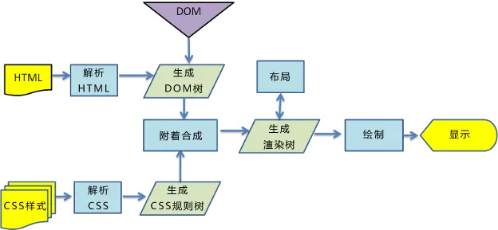

# 浏览器渲染流程

## 关键渲染路径

关键渲染路径是指浏览器从最初请求来的 HTML、CSS、javascript等资源，然后解析、构建树、渲染布局、绘制，最后呈现给客户看到的界面的整个过程。

## 构建 DOM 树

当浏览器接收到服务器响应来的 HTML 文档后，会遍历文档节点，生成 DOM 树。

## 构建 CSSDOM 规则树

浏览器解析 CSS 文件并生成 CSS 规则树，每个 CSS 文件都被分析成一个 StyleSheet 对象，每个对象都包含 CSS 规则。CSS 规则对象包含对应于 CSS 语法的选择器和声明对象以及其他对象。

## 渲染阻塞

当浏览器遇到一个 script 标签时，DOM 构建将暂停，直至脚本完成执行，然后继续构建 DOM。每次去执行 JS 脚本都会严重地阻塞 DOM 树的构建，如果 JS 脚本还操作了 CSSDOM，而正好这个 CSSDOM 还没有下载和构建，浏览器还会延迟脚本执行和构建 DOM，直至完成 CSSDOM 的下载和构建。

因此项目中需要遵循以下两个原则：

- css 优先
- js 滞后

当解析 html 的时候，会把新来的元素插入 dom 树中，同时去查找 css，然后把对应的样式规则应用到元素上，样式查找顺序按照从右到左的顺序匹配。

因此写 CSS 时，尽量避免过度层叠。

## 构建渲染树

浏览器会从 DOM 树的根节点开始遍历每个可见节点，对每个可见节点，找到其 CSS 样式规则并应用。

渲染树中的每个节点都是可见节点，display 为 none 不会再树中，但 visibility 为 hidden 的元素会在树中。

## 布局

布局阶段会从渲染树的根节点开始遍历，然后确定每个节点对象在页面上的确切大小与位置，布局阶段输出盒子模型，它会精确地捕获每个元素在屏幕内的确切位置与大小。

## 绘制

在绘制阶段，遍历渲染树，调用渲染器的 paint 方法在屏幕上显示其内容。渲染树的绘制工作是由浏览器的 UI 后端组件完成的。

## reflow 与 repaint

根据渲染树布局，计算 css 样式，即每个节点在页面中的大小和位置等几何信息。HTML 默认是流式布局，CSS 和 JS 会打破这种布局，改版 DOM 的外观样式及大小和位置。
- repaint: 屏幕的一部分重画，不影响整体布局。比如更改背景颜色。
- reflow: 改变了元素的几何尺寸，需要重新验证并计算渲染树。渲染树的一部分或全部发生了变化

