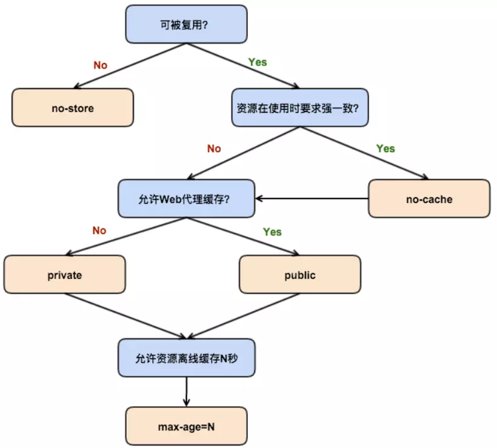

# 前端缓存

## 缓存位置

- service worker
- memory cache
- disk cache
- push cache

### memory cache

一旦关闭 Tab 内存中的缓存会被释放

## 强缓存

### expires

缓存过期时间，值为一个具体的时间，需要和 Last-modified 结合使用。

expires 为 HTTP/1 的产物，受限于本地时间。

### cache-control

|指令|作用|
|---|---|
|public|响应可一个被客户端和代理服务器缓存|
|private|响应只可以被客户端缓存|
|max-age=30|缓存30秒后过期|
|s-maxage=30|覆盖max-age,只在代理服务器中生效|
|no-store|不缓存任何响应|
|no-cache|资源被缓存，但立即失效，下一会发起请求验证资源是否过期|
|max-stale|30秒内即便缓存过期，也使用改缓存|
|min-fresh=30|希望在30秒内获取最新的响应|

- public 客户端和代理服务器都可以缓存。

    browser <-- proxy1 <-- proxy2 <-- server 中间的 proxy 可以缓存资源。

- private 内容只有客户端可以缓存

    cache-control 默认值

- no-cache 客户端缓存内容，是否使用缓存需要经过协商缓存验证。

    使用缓存数据前会向服务端发送请求验证是否可用(etag/last-modified)。

- no-store 所有内容都不会缓存

- max-age 缓存在固定秒数后失效

- s-max-age 与 max-age 相同，但只在代理服务器中有效。

- max-stale 能容忍的最大过期时间。

- min-fresh 能够容忍的最小新鲜度。

#### 如何使用



### expires 与 cache-control 对比

expires 为 1.0 用法，只能指定固定时间。cache-control 优先级高于 expires。

## 协商缓存

- 缓存失效 服务端返回200和请求结果
- 缓存可用 服务端304 not mofidied

### last-modified 与 if-modified-since

浏览器第一次访问资源时，服务器返回的 header 中添加 last-modified，指定资源的最后修改时间。

浏览器下次访问资源时，将上次 last-modified 的值放入 if-modified-since，服务器根据此值，与资源的最后变动时间对比，如果没有变化返回 304，浏览器直接使用胡村，如果已经变化了 服务端返回 200 和新的资源。

#### 弊端

- 本地打开文件，并没有修改，还是会造成 last-modified 被修改，导致服务端不能命中缓存，发送相同的资源
- last-modified 只能以秒计时，如果在很短的时间内修改了文件，服务端还是会返回 304

### etag 与 if-none-match

浏览器第一次访问资源时，服务端返回的 header 中添加 etag，值为资源的唯一标识，资源有变化会重新生成。

浏览器下一次访问资源时，会将上次的 etag 放到 if-none-match 中，服务器会比对 if-none-match 的值与资源 etag 的值，如果相同，返回 304 浏览器使用缓存，否则返回200 返回资源。

### 两者对比

- 精确度上 etag 优于 last-modified
- 性能上 etag 慢于 last-modified
- 优先级上 服务器优先考虑 etag

## 缓存机制


## 缓存策略

- 频繁变动的资源
    使用 etage 或者 last-modified 每次都验证是否使用缓存，虽不能减少请求数量，但能减少响应数据大小。
    ```
    cache-control: no-cache
    ```

- 不常变化的资源
    设置一个很长的过期时间，当内容更新时，在请求路径中添加 hash、版本号、动态字符等。
    ```
    cache-control: max-age=31536000
    ```

## 用户行为对缓存的影响

- 打开网页，地址栏输入
    查找 disk cache 中是否有匹配
- F5普通刷新
    因为 Tab 没有关闭，因此 memory cache 可用，会被优先使用
- CTRL + F5 强制刷新
    浏览器不使用缓存，发送头部均带有 cache-control: no-cache
